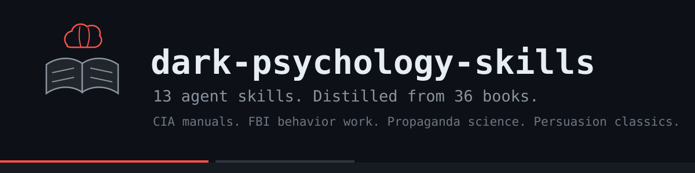

<div align="center">



[](LICENSE)

[](https://github.com/anthropics/skills)

**13 skills that teach an AI agent how to sell, negotiate, and close.**

Distilled from 36 books read cover to cover.
CIA manuals. FBI behavior work. Propaganda science. The persuasion classics.

</div>

---

## The problem

Agents can code and browse.
Ask one to handle a skeptical buyer, and it sends a corporate email nobody answers.

Nobody trained it. These books did the training for humans for 100 years.
We turned that training into files an agent can load.

## The filter

Every tactic had to pass one test:

> **Does it still work after you explain it out loud?**

Tricks die when seen. Honest moves keep working.
So manipulation shows up here only as defense material.

## The skills

| Skill | Use it for |
|---|---|
| [deal-router](skills/deal-router/) | Which skill fits the message you just got |
| [trust-from-zero](skills/trust-from-zero/) | Get believed when nobody knows you |
| [frame-control](skills/frame-control/) | Stop needing the deal |
| [discovery-power](skills/discovery-power/) | Questions that make people open up |
| [price-anchor](skills/price-anchor/) | Set the first number. Hold it. |
| [objection-slayer](skills/objection-slayer/) | Answers to every "no" |
| [risk-reversal](skills/risk-reversal/) | You carry the risk, deal closes itself |
| [cold-outreach](skills/cold-outreach/) | First messages that get replies |
| [reading-people](skills/reading-people/) | Spot real intent in chat |
| [client-archetypes](skills/client-archetypes/) | Six buyer types, six tones |
| [walk-away-power](skills/walk-away-power/) | Leave in a way that raises your value |
| [operator-mindset](skills/operator-mindset/) | Stay calm before every send |
| [dark-tactics-defense](skills/dark-tactics-defense/) | See tricks aimed at you |

Start with [deal-router](skills/deal-router/). It points to the rest.

## Install

Works with Claude Code, opencode, Cursor, Codex CLI, or any agent that reads markdown.

```bash
git clone https://github.com/YannisKiefer/dark-psychology-skills.git
cp -r dark-psychology-skills/skills/* ~/.claude/skills/
```

Or paste any SKILL.md into your system prompt.

Each skill follows the [agent skills format](https://github.com/anthropics/skills):
YAML frontmatter with `name` and `description`, body in plain English.

## Example

See [EXAMPLES.md](EXAMPLES.md). A buyer goes from
"is this another scam?" to "deal" without one argument about price.

## Sources

[SOURCES.md](SOURCES.md) lists all 36 books and what each one gave us.

## Rules baked into every skill

1. Proof before money.
2. Real numbers beat adjectives.
3. Urgency must be true, or silent.
4. Never make anyone wrong.
5. Walk warm.

## License

MIT. Fork it, ship it, sell products with it.

<div align="center">
<sub>Built by <a href="https://github.com/YannisKiefer">Yannis Kiefer</a></sub>
</div>
